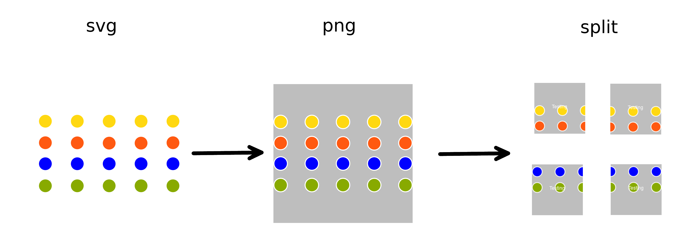

# TileLayers from SVG - A Bash Script

Creates a set of TileLayers from an svg file that can be used for rendering with [Leaflet.js](https://leafletjs.com/)
based on the [ImageMagick](https://www.imagemagick.org/script/index.php) stack

Developed and applied under Fedora. Other distros should work as well, but were not tested.

## Summary

1. The script converts the svg file into a png, were it will be resized to a form of 2^{max(zoomlevel)}x256.
Therefore one side needs extra image data since it will be shrunk to keep the aspect ratio and will be [spliced](https://imagemagick.org/script/command-line-options.php#splice) into the image with a color given by the user.
2. Then a directory is created with the same name as the file and subdirectories based on the available zoom levels.
3. For each level, the original png file will be resized, split into 256x256px squares and annotated.

## Installation & Usage

Copy the script to your svg folder and make it executable.

The script takes two arguments:
1. The file that needs to be processed. Do not add an ./ since it will take the filename as a directory name
2. [Density parameter](https://imagemagick.org/script/command-line-options.php#density) which specifies the image resolution. For huge svgs one should be careful since the file size increases rapidly. Start with a small value, e.g. 20.

Example:
~~~~
> chmod +x ./createtiles.sh
> ./createtiles.sh test.svg 250
~~~~

and the output:
~~~~
> Zoomlevel:  4
> Dim:  2048  x  2048
> Working on: 2048  x  2048
> Working on: 1024  x  1024
> Working on: 512  x  512
> Working on: 256  x  256
> Working on: 128  x  128
> Finished
~~~~
The total image has a size of 2048x2048 px and 4 zoom levels.

The files in /example/{zoomlevel}/ can then be used with leaflet in a \*.js file like:
~~~~
var map = L.map('map', {
  minZoom: 0,
  maxZoom: 4,
  crs: L.CRS.Simple
}).setView([75, 75],4);

sw = map.unproject([0, 2048], map.getMaxZoom());
ne = map.unproject([2048, 0], map.getMaxZoom());
map.setMaxBounds(new L.LatLngBounds(sw, ne));

L.tileLayer('/img/fm4/example/{z}/map_{y}_{x}.png').addTo(map);
~~~~

## Parameters in the script
The following parameters can be changed within the script:
* *square* - Length of the tiles. Default is 256 px
* *bckcolor* - Color used as a background for rendering the svg and splicing
* *zoomlevel* - Max. zoomlevel for rendering. In case of insufficient resolution the max. level will be chosen by the script
* *annotate* - Text for annotation of tiles. If you do not want an annotation you must replace the last convert command with a simple *mv*

## Known Issues
It can happen that ImageMagick is only able to render the svg up to a certain density.
Beyond that, the png will be nearly empty and one has to choose a lower resolution.
